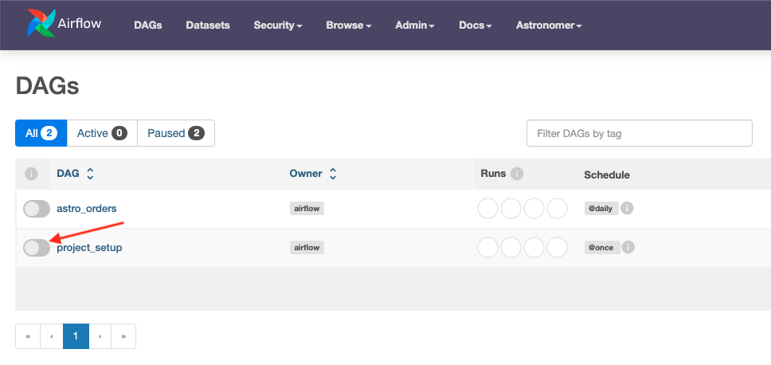
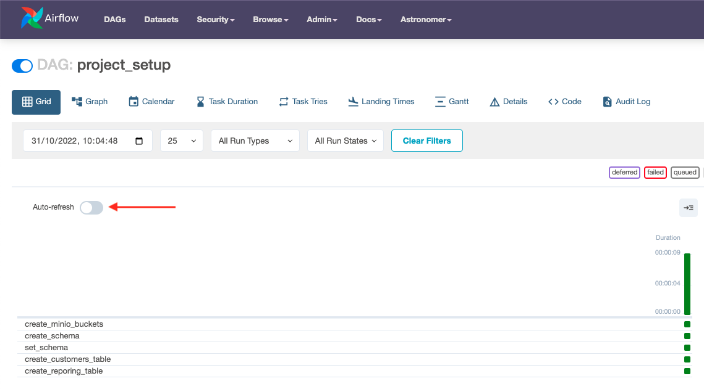
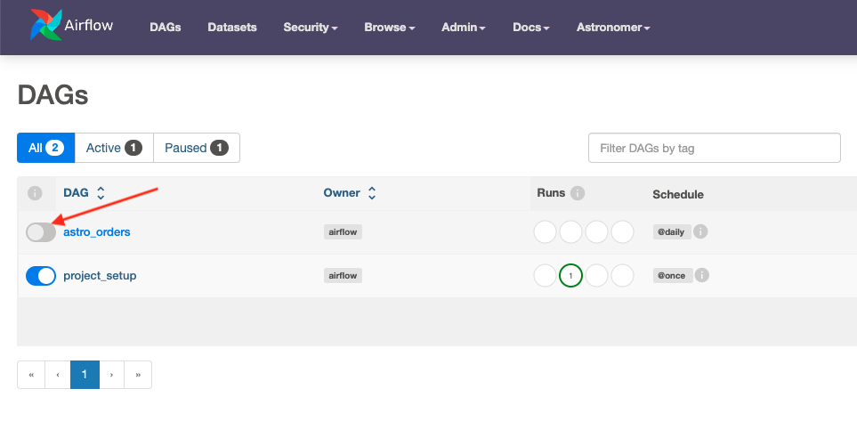
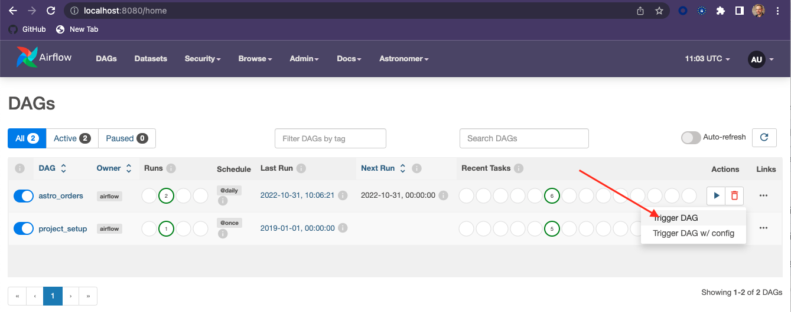
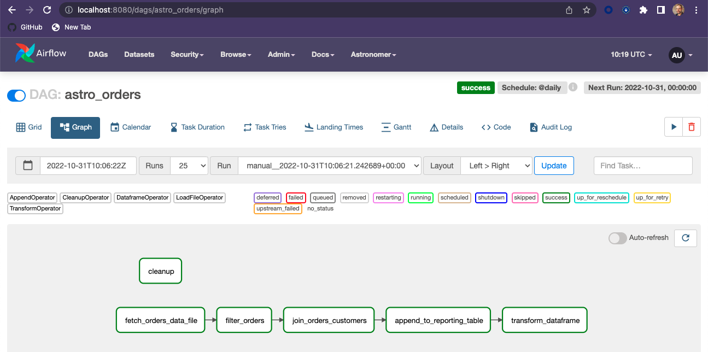
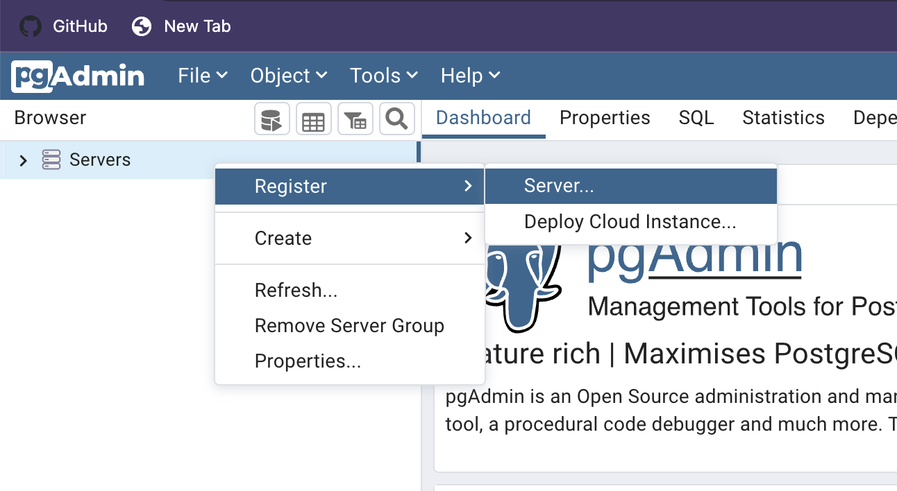
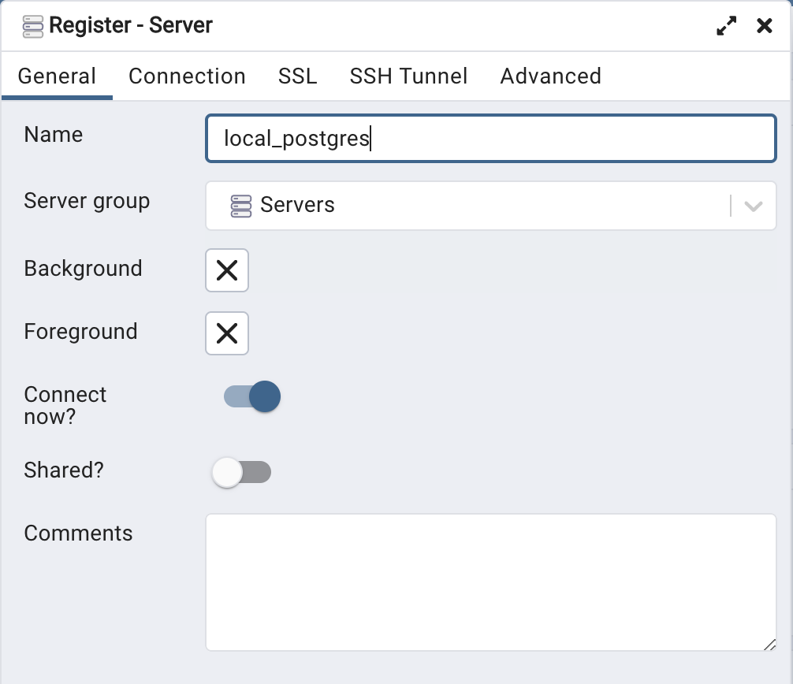
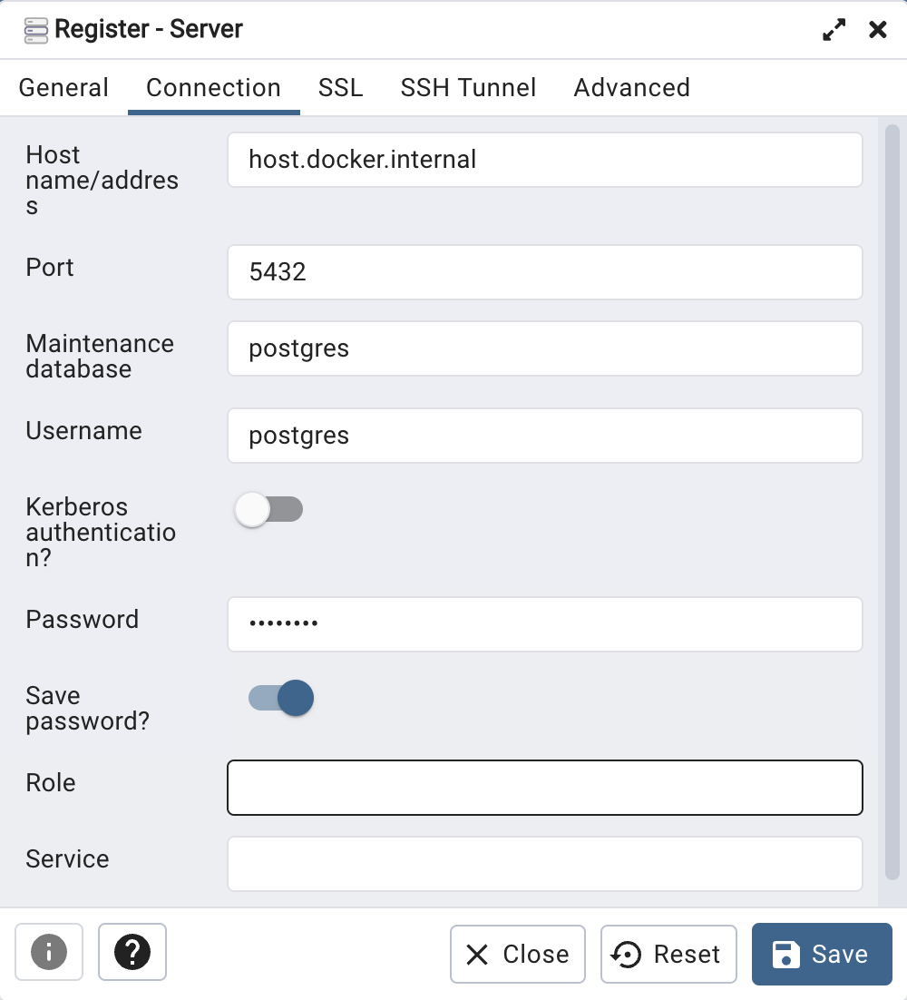
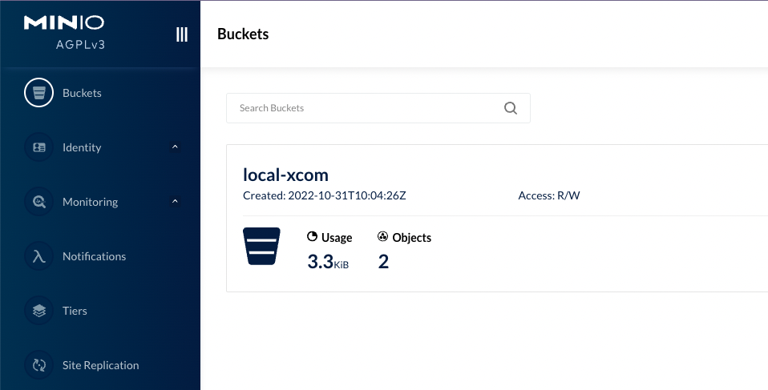

# Astro Python SDK Local Development Tutorial
## Build and Run Airflow ETL Pipeline Locally

This repo is to help you get up and running quickly with the Astro Python SDK for local development. The DAGs and the workflow are adapted from the [Astronomer Astro Python SDK tutorial](https://docs.astronomer.io/learn/astro-python-sdk). The tutorial is a walk through of the features and demonstrates how to write an Extract, Transform, Load (ETL) pipeline on your local machine using the Astro Python SDK. The Astro SDK is maintained by Astronomer and simplifies the pipeline authoring process with native Python functions for common data orchestration use cases.

The pipeline you build in this tutorial will:

* Extract a remote csv file into a local Postgres relational table.
* Transform that table.
* Load the transformed table into a reporting table.

The example DAG in this local version uses [Minio](http://min.io) S3 and Postgresql, but you can replace these with any supported data sources and tables simply by changing connection information.

## Prerequisites
To complete this tutorial, you need:

* [Docker Desktop](https://www.docker.com/) installed.
* The [Astro CLI](https://docs.astronomer.io/astro/cli/get-started)


### Step 1: Get the repo
Clone this repo to your local machine:
```
git clone https://github.com/fletchjeff/astro_sdk_workshop
```

### Step 2: Start `astro`
Start up the local `astro` services.
```
astro dev start
```

### Step 3: Run the Project Setup DAG
The the project setup DAG to configure the minio S3 buckets and the postgres schema and tables.
* Open the Airflow UI at http://localhost:8080/

User: `admin`  
Password: `admin`

You should see 2 DAGs in the DAGs list, `astro_orders` and `project_setup`. Activate the `project_setup` DAG but clicking the slider next to the name. 



The `project_setup` DAG only needs to be run once and will configure everything you need for the project. Once its complete, if you click on the `project_setup` name in the DAG list, you should see the following in the grid view.



If its still running, enabling the Auto-refresh with the slider in the grid view will update the grid as the DAG completes the various tasks.

### Step 4: Run the code
1. In the Airflow UI, you should see a DAG called astro_orders. Make it active by clicking the slider next to its name:
 


2. Click the play button next to the DAG's name to run the DAG:



3. Click the DAG's name and then the Graph icon to see how it ran in the Graph view:
   


### Optional: View Tables in PGAdmin
You can view the tables created for this tutorial by connecting to the local PGAdmin service created when astro launches.

Open the PGAdmin UI at http://localhost:5050/

User: `name@example.com`  
Password: `admin`

Add a new server by right clicking on Server, then Register > Server...



The create the new connection using the following settings:


<!--  -->




### Optional: View S3 Buckets in Minio
You can view the files created for this tutorial by connecting to the local Minio console created when astro launches.

Open the Minio console at http://localhost:9001/login

User: `minioadmin`  
Password: `minioadmin`



### Table Creation
The SQL used to the create the tables in the local Postgres instance is slightly different to that used for Snowflake in the original tutorial. Below is the SQL statements executed in the `project_setup` step.

```SQL
CREATE SCHEMA TMP_ASTRO;
```

```SQL
SET search_path TO TMP_ASTRO;
```

```SQL
CREATE TABLE customers_table (
    customer_id CHAR(10), 
    customer_name VARCHAR(100), 
    type VARCHAR(10)
    );
```

```SQL
INSERT INTO customers_table (CUSTOMER_ID, CUSTOMER_NAME,TYPE) 
    VALUES 
    ('CUST1','NAME1','TYPE1'),
    ('CUST2','NAME2','TYPE1'),
    ('CUST3','NAME3','TYPE2');
```

```SQL
CREATE TABLE reporting_table (
    CUSTOMER_ID CHAR(30), 
    CUSTOMER_NAME VARCHAR(100), 
    ORDER_ID CHAR(10), 
    PURCHASE_DATE VARCHAR(100), 
    AMOUNT FLOAT, TYPE CHAR(10)
    );
```

```SQL
INSERT INTO reporting_table (CUSTOMER_ID, CUSTOMER_NAME, ORDER_ID, PURCHASE_DATE, AMOUNT, TYPE) 
    VALUES
    ('INCORRECT_CUSTOMER_ID','INCORRECT_CUSTOMER_NAME','ORDER2','2/2/2022',200,'TYPE1'),
    ('CUST3','NAME3','ORDER3','3/3/2023',300,'TYPE2'),
    ('CUST4','NAME4','ORDER4','4/4/2022',400,'TYPE2');
```
