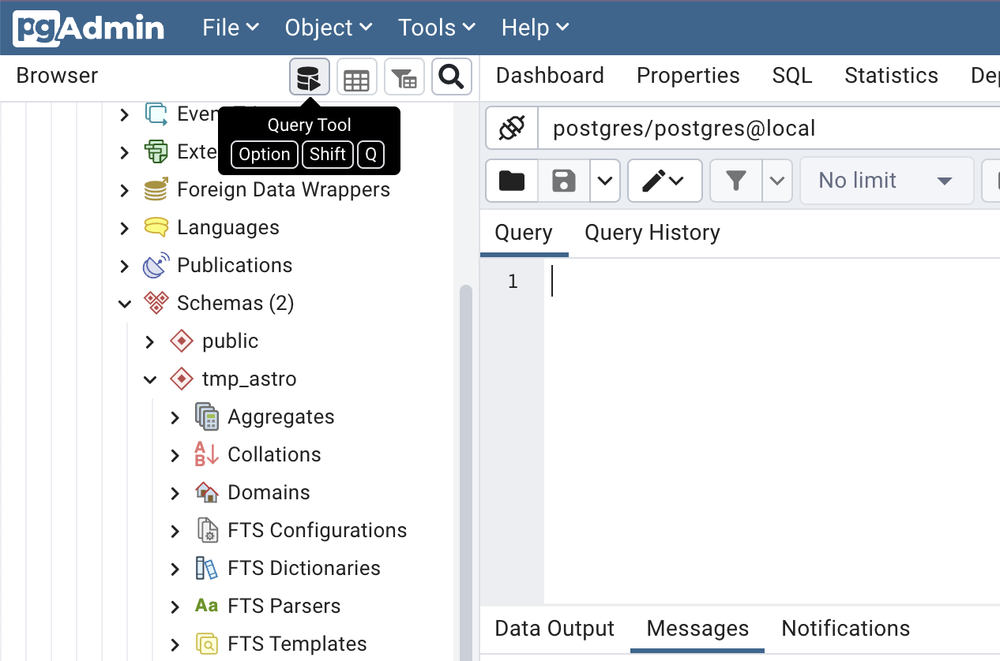
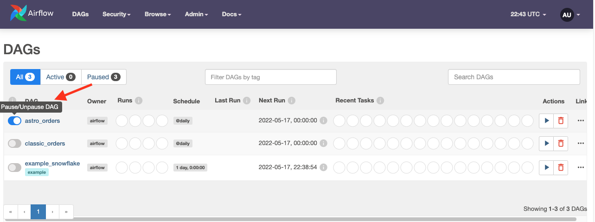
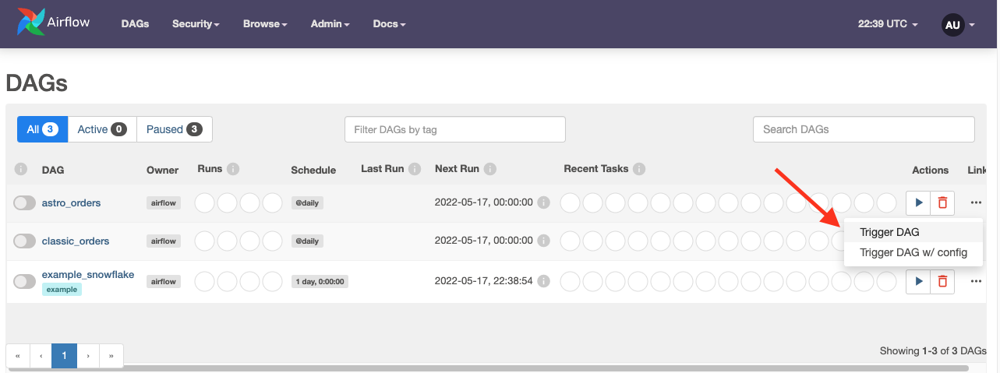
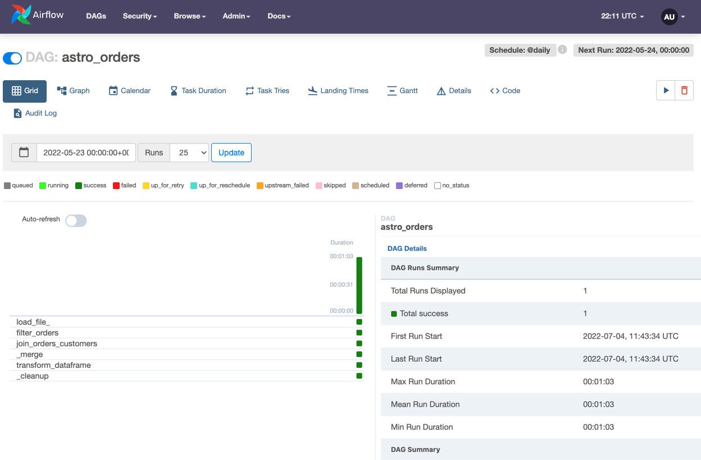

# Go Data Fest
## Data Orchestration and Data Lineage with Astronomer

This repo is for the Go Data Fest workshop. This tutorial demonstrates how to write an Extract, Transform, Load (ETL) pipeline on your local machine with the Astro Python SDK. The Astro SDK is maintained by Astronomer and simplifies the pipeline authoring process with native Python functions for common data orchestration use cases.

The pipeline you build in this tutorial will:

* Extract a file into a Snowflake relational table.
* Transform that table.
* Load the transformed table into a reporting table.

The example DAG in this tutorial uses Amazon S3 and Snowflake, but you can replace these with any supported data sources and tables simply by changing connection information.

## Prerequisites
To complete this tutorial, you need:

* [Docker Desktop](https://www.docker.com/) installed.
* The [Astro CLI](https://docs.astronomer.io/astro/cli/get-started)


### Step 1: Get the repo
Clone this repo to your local machine:
```
git clone https://github.com/fletchjeff/astro_sdk_workshop
```

### Step 2: Start `astro`
Start up the local `astro` services.
```
astro dev start
```

### Step 3: Create the Postgres Connection
Create Airflow connections to the local postgres server.
* Open the Airflow UI at http://localhost:8080/
* Go to **Admin > Connections**

Create a new Postgres connection with the following values:

- Connection ID: `local_postgres`
- Connection type: `Postgres`
- Host: `host.docker.local` [Note: If this doesn't work, use the IP address of your local machine]
- Schema: *[leave this blank]*
- Login: `postgres`
- Password: `postgres`
- Port: `5432`

### Step 4: Configure Postgres
Open the PGAdmin UI at http://localhost:5050/

Add a new server by right clicking on Server, then Register > Server...


The create the new connection using the following settings:


### Step 5: Create the Tables
In the PGAdmin UI, click on the Query Tool:


Run the following queries in the Query Tool:

```
CREATE SCHEMA TMP_ASTRO;
```

```
SET search_path TO TMP_ASTRO;
```

```
CREATE TABLE customers_table (customer_id CHAR(10), customer_name VARCHAR(100), type VARCHAR(10) );
```

```
INSERT INTO customers_table (CUSTOMER_ID, CUSTOMER_NAME,TYPE) VALUES     ('CUST1','NAME1','TYPE1'),('CUST2','NAME2','TYPE1'),('CUST3','NAME3','TYPE2');
```

```
CREATE TABLE reporting_table (
    CUSTOMER_ID CHAR(30), CUSTOMER_NAME VARCHAR(100), ORDER_ID CHAR(10), PURCHASE_DATE VARCHAR(100), AMOUNT FLOAT, TYPE CHAR(10));
```

```
INSERT INTO reporting_table (CUSTOMER_ID, CUSTOMER_NAME, ORDER_ID, PURCHASE_DATE, AMOUNT, TYPE) VALUES
('INCORRECT_CUSTOMER_ID','INCORRECT_CUSTOMER_NAME','ORDER2','2/2/2022',200,'TYPE1'),
('CUST3','NAME3','ORDER3','3/3/2023',300,'TYPE2'),
('CUST4','NAME4','ORDER4','4/4/2022',400,'TYPE2');
```

### Step 6: View the DAG for this simple ETL workflow
Use your favorite code editor or text editor to view the [`astro_orders.py`](dags/astro_orders.py) file in your project's dags directory.

This DAG extracts the data you loaded into S3 and runs a few simple SQL statements to clean the data, load it into a reporting table on Snowflake, and transform it into a dataframe so that you can print various table details to Airflow logs using Python.

Much of this DAG's functionality comes from the Python functions that use task decorators from the Python SDK. See the [How it works](https://docs.astronomer.io/learn/astro-python-sdk#how-it-works) section for more information about these decorators and the benefits of using the SDK for this implementation.

### Step 7: Run the code
1. In the Airflow UI, you should see a DAG called astro_orders. Make it active by clicking the slider next to its name:

2. Click the play button next to the DAG's name to run the DAG:

3. Click the DAG's name to see how it ran in the Grid view:


<!-- ## [How it works]
The example DAG uses the TaskFlow API and decorators to define dependencies between tasks. If you're used to defining dependencies with bitshift operators, this might not look familiar. Essentially, the TaskFlow API abstracts dependencies, XComs, and other boilerplate DAG code so that you can define task dependencies with function invocations.

The Astro SDK takes this abstraction a step further while providing more flexibility to your code. The most important details are:

* Using `aql` decorators, you can run both SQL and Python within a Pythonic context. This example DAG uses decorators to run both SQL queries and Python code

* The Astro SDK includes a `Table` object which contains all of the metadata that's necessary for handling SQL table creation between Airflow tasks. When a `Table` is passed into a function, the Astro SDK automatically passes all connection, XCom, and metadata configuration to the task.

* The example DAG demonstrates one of the key powers of the `Table` object. When the DAG ran `join_orders_customers`, it joined two tables that had different connections and schema. The Astro SDK automatically creates a temporary table and handles joining the tables. This also means that you can replace the S3 and Snowflake configurations with any valid configurations for other supported data stores and the code will still work. The Astro SDK handles all of the translation between services and database types in the background.

* The Astro SDK can automatically convert to SQL tables to pandas DataFrames using the `aql.dataframe`, meaning you can run complex ML models and SQL queries on the same data in the same DAG without any additional configuration.

Now that you understand the core qualities of the Astro SDK, let's look at it in the context of the example DAG by walking through each step in your ETL pipeline.

### Extract
To extract from CSV into a SQL Table, you only need to specify the location of the data and an Airflow connection for the destination SQL table in Postgres.
```Python
orders_data = aql.load_file(
    # data file needs to have a header row
    input_file=File(path=S3_FILE_PATH + "/orders_data_header.csv", conn_id=S3_CONN_ID),
    output_table=Table(conn_id=SNOWFLAKE_CONN_ID),
)
``` -->
